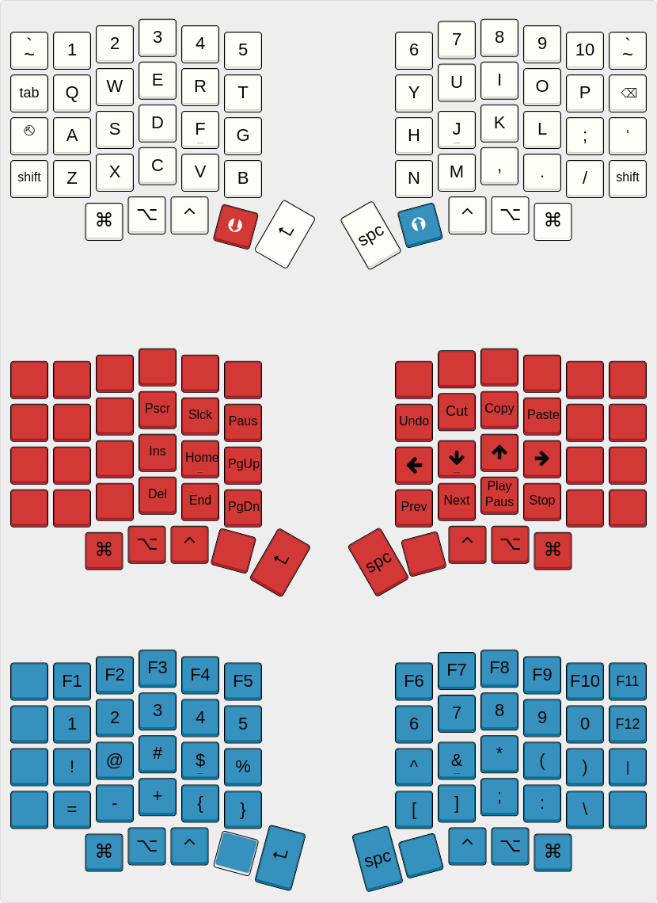

# Via-compatible custom keymap for Sofle

## Layout

View in [Keyboard Layout Editor](http://www.keyboard-layout-editor.com/#/gists/a1f6519e723ad81ca151741b53a28b80)

## Features

- Via support
- Mode for soft escape (`Esc` when tapped, `Ctrl` when held) 
- Vim-style navigation (`h` `j` `k` `l` as arrow keys)
- Mode for standard navigation cluster
- Toggling between layers when encoders are pressed
- Left encoder controls `VOLUP`/`VOLDOWN`. Right encoder `PGUP`/`PGDN`.
